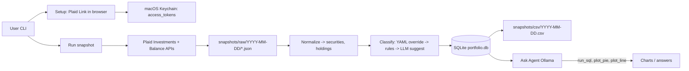

## Decisions confirmed in this session

- Data ingress: **Plaid-only for v1** (all existing brokerage accounts are Plaid-supported). **CSV / manual import adapter is out of scope for v1**; revisit only if an institution drops off Plaid or you add unsupported assets later.
- Asset categorization: **YAML override file + LLM-suggested classifications for new tickers** (confirmed before persisting). Deterministic on subsequent runs.
- Storage: **SQLite (`portfolio.db`) is the source of truth** for normalized holdings, classifications, and snapshot history; **CSV is a derived export** per run date. Raw Plaid JSON archived per snapshot for replay/debug.
- Ask Agent: **read-only SQL + structured chart tools** (`run_sql`, `plot_pie`, `plot_line`, etc.) — confirmed.
- Local LLM: **Ollama** (HTTP API; model TBD, e.g. `llama3.1` or `qwen2.5` with reliable tool calling).
- Family: **v1 is a single combined household view**; each account carries an **owner tag** for future filtering, not separate dashboards in v1.
- Snapshot cadence: **ad-hoc only** — user runs `portfolio snapshot` when they want a report; no `launchd` scheduling in v1.

## High-level architecture

## Refined user journey

### 1. One-time setup
- `portfolio setup` launches a tiny local web server on `http://localhost:8765`, opens the browser to a page that runs Plaid Link.
- For each institution: user completes Link, callback receives `public_token`, server exchanges it for an `access_token` via `/item/public_token/exchange`, stores it in **macOS Keychain** keyed by `item_id`. Also stores institution name, list of accounts, and per-account metadata in `portfolio.db`.
- User marks each account: **include / exclude**, **owner tag** (e.g., `me`, `spouse`), and **tax treatment** auto-derived from `account.subtype` with a manual override (taxable vs tax-advantaged; the tool should also distinguish *pre-tax* vs *Roth* vs *HSA/529* since you may want that view later).
- Same flow re-runs to add an institution or to handle `ITEM_LOGIN_REQUIRED` via Plaid update mode.

### 2. Snapshot run (`portfolio snapshot`)

**Principle:** `portfolio.db` (SQLite) is the **canonical store** for every snapshot. Files on disk are either **immutable raw inputs** (Plaid JSON) or **derived exports** (CSV). The Ask Agent and any future analytics always read from SQLite, not from CSV alone.

1. **Fetch from Plaid.** For each linked Item, call `/accounts/balance/get` and (where applicable) `/investments/holdings/get`. Save raw JSON to `snapshots/raw/YYYY-MM-DD/<item_id>.json` (audit / replay).
2. **Normalize and persist to SQLite (source of truth).** In a single logical transaction per snapshot date:
   - Upsert `securities` from the Plaid securities list (ticker, name, `plaid_type`, `plaid_subtype`, `is_cash_equivalent`, etc.).
   - Insert rows into `holdings_snapshot` for that `snapshot_date` (and/or replace the slice for that date if you use a delete-then-insert pattern per run). Include `institution_price_as_of` for staleness.
   - For depository accounts, persist cash as either dedicated `cash_snapshot` rows or synthetic holdings tied to a well-known “cash” security id — same pipeline as investment holdings.
   - Commit so the DB always reflects the latest successful ingest before classification proceeds.
3. **Classify (still writing back to SQLite).** Map each distinct security in this snapshot to one of {Cash, Bond, Equity, Gold, Commodity, Crypto}:
   - Look up `ticker` in `classification.yaml`. Hit → use it; record/update `classifications` (or equivalent) in SQLite so the canonical bucket is queryable without re-parsing YAML at read time.
   - Else apply rules: `is_cash_equivalent=true` or Plaid `type=cash` → Cash; `fixed income` → Bond; `equity` → Equity; `cryptocurrency` → Crypto; `etf`/`mutual fund`/`other` → **unclassified**.
   - For each unclassified ticker, ask Ollama with `(ticker, name, plaid_type, plaid_subtype)` for a suggested bucket + confidence. Prompt the user to accept/edit; persist into `classification.yaml` **and** mirror into SQLite (`classifications`). Snapshot is incomplete while any holding above a configurable dollar threshold remains unclassified.
4. **Materialize derived views in SQLite (optional but recommended).** e.g. a `snapshot_summary(snapshot_date, bucket, tax_treatment, total_value)` table or view built from `holdings_snapshot` + `classifications` + `accounts`, so `run_sql` stays simple and fast.
5. **Export CSV from SQLite (derived only).** Query the DB and write `snapshots/csv/YYYY-MM-DD.csv` — one row per `(date, account, ticker, bucket, quantity, price, value, tax_treatment, owner_tag)`, plus summary rows. If CSV export fails, the snapshot in SQLite is still valid.
6. **Console summary.** Total value, per-bucket allocation, drift vs prior `snapshot_date` (from DB), items needing re-auth, any still-unclassified holdings.

### 3. Ask Agent (`portfolio ask "<question>"`)
- **Ollama** hosts the model; the app calls its HTTP API with tool definitions:
  - `run_sql(query: str) -> rows` — read-only against `portfolio.db`.
  - `plot_pie(labels, values, title)` — saves a PNG to `outputs/` and returns the path.
  - `plot_line(x, series, title)` — same.
  - `summarize(rows) -> str` — for textual responses.
- LLM plans, calls tools, returns a final answer plus any chart paths. Tool layer enforces read-only SQL and a row-count cap.

## Data model sketch

- `items(item_id, institution_name, status, last_synced_at)`
- `accounts(account_id, item_id, name, subtype, owner_tag, included, tax_treatment, tax_treatment_override)`
- `securities(security_id, ticker, name, plaid_type, plaid_subtype, is_cash_equivalent)`
- `classifications(ticker, bucket, source, classified_at)` — source ∈ {yaml, llm_confirmed, rule}
- `holdings_snapshot(snapshot_date, account_id, security_id, quantity, institution_price, institution_value, institution_price_as_of)`
- `cash_snapshot(snapshot_date, account_id, balance)` (for depository accounts; or merged into `holdings_snapshot` via a synthetic security_id)

## Recommended tech stack

- **Python 3.12** for the whole thing (Plaid Python SDK is mature, pandas/matplotlib for charts, `sqlite3` built in, `keyring` for Keychain).
- **Local LLM**: Ollama (e.g., `llama3.1` or `qwen2.5`) over its HTTP API — easy to swap models without changing the app. Good function-calling support in recent models is important for the Ask Agent.
- **CLI**: `typer` or `click`. Local web server for Plaid Link: `fastapi` + `uvicorn` (only runs during setup/re-link).

## Things to validate before building

- **Plaid Production access for personal use.** Apply on the Dashboard before writing code; if denied, the whole plan needs reshaping. Sandbox is fine for early development.
- **Coverage of your specific institutions.** Spot-check Plaid's Coverage Explorer for each linked institution; v1 assumes all stay in scope (no CSV escape hatch in product).
- **Quote staleness expectations.** Holdings update once/day at most institutions. Confirm that "end-of-prior-business-day" pricing is acceptable for your reports.

## Open items (remaining)

- **Ollama model choice** — pick a model with reliable tool/function calling after a quick smoke test (e.g. `llama3.1`, `qwen2.5`).

## Out of scope for v1 (explicit)

- **CSV / manual import adapter** for holdings (Plaid-only ingress).
- Tax-lot tracking / cost basis / capital gains.
- Trade execution (Plaid is read-only anyway; SnapTrade would be needed if this ever changed).
- Performance attribution (TWR/MWR), benchmark comparisons.
- Multi-currency consolidation.
- Per-owner dashboards (owner tags exist; combined view only).
- Scheduled snapshots (`launchd` / cron).
- Web UI. CLI + generated chart PNGs only.