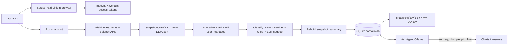
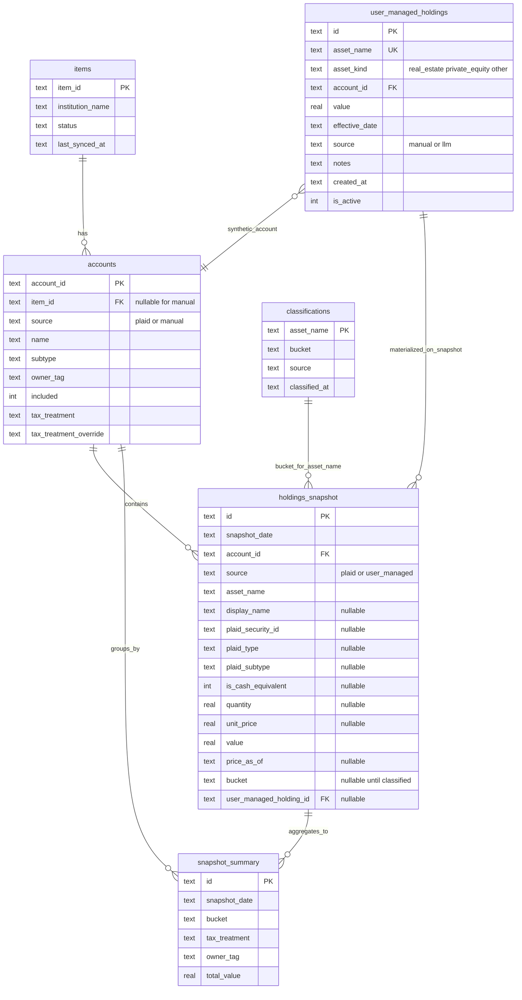

## Decisions confirmed in this session

- Data ingress: **Plaid-only for v1** (all existing brokerage accounts are Plaid-supported). **CSV / manual import adapter is out of scope for v1**; revisit only if an institution drops off Plaid or you add unsupported assets later.
- Asset categorization: **YAML override file + LLM-suggested classifications for new tickers** (confirmed before persisting). Deterministic on subsequent runs. **Buckets:** Cash, Bond, Equity, Gold, Commodity, Crypto, **RealEstate**; private equity (`asset_kind=private_equity`) maps to **Equity**.
- Storage: **SQLite (`portfolio.db`) is the source of truth** for normalized holdings, classifications, and snapshot history; **CSV is a derived export** per run date. Raw Plaid JSON archived per snapshot for replay/debug.
- **Manual / semi-permanent assets** (real estate, PE, etc.): stored in **`user_managed_holdings`** (value history with `effective_date`); **materialized into `holdings_snapshot`** on each snapshot run. Not Plaid-fetched; updated ad-hoc via CLI or LLM-assisted edit.
- Ask Agent: **read-only SQL + structured chart tools** (`run_sql`, `plot_pie`, `plot_line`, etc.) — confirmed.
- Local LLM: **Ollama** (HTTP API; model TBD, e.g. `llama3.1` or `qwen2.5` with reliable tool calling).
- Family: **v1 is a single combined household view**; each account carries an **owner tag** for future filtering, not separate dashboards in v1.
- Snapshot cadence: **ad-hoc only** — user runs `portfolio snapshot` when they want a report; no `launchd` scheduling in v1.
- **`snapshot_summary` table:** materialized on every snapshot run (not optional). Aggregates `holdings_snapshot` for fast `run_sql` / pie charts.
- **Plaid `asset_name`:** use `ticker_symbol` when present; **fallback to `plaid_security_id`** when ticker is missing.
- **Same-date re-run:** **replace** all rows for that `snapshot_date` in `holdings_snapshot` and `snapshot_summary` (delete-then-insert); never append duplicates.
- **`snapshot_summary` rollups:** grouped by `(snapshot_date, bucket, tax_treatment, owner_tag)` only — **no sentinel rows** (e.g. no `_total` / `_all`). Household grand total = `SUM(total_value)` over summary rows for a date in SQL.

## High-level architecture



## Refined user journey

### 1. One-time setup
- `portfolio setup` launches a tiny local web server on `http://localhost:8765`, opens the browser to a page that runs Plaid Link.
- For each institution: user completes Link, callback receives `public_token`, server exchanges it for an `access_token` via `/item/public_token/exchange`, stores it in **macOS Keychain** keyed by `item_id`. Also stores institution name, list of accounts, and per-account metadata in `portfolio.db`.
- User marks each account: **include / exclude**, **owner tag** (e.g., `me`, `spouse`), and **tax treatment** — only **`taxable`** or **`tax-advantaged`** (auto-derived from `account.subtype`; overridable). Pre-tax 401k, Roth, HSA, 529, etc. all map to `tax-advantaged`.
- Same flow re-runs to add an institution or to handle `ITEM_LOGIN_REQUIRED` via Plaid update mode.

### 1b. User-managed assets (real estate, PE, etc.)
- `portfolio managed add` — register a semi-permanent asset: `asset_name`, `asset_kind` (`real_estate` | `private_equity` | `other`), `owner_tag`, `tax_treatment`, initial `value`, `effective_date`, optional `notes`. Creates a row in `user_managed_holdings` and a **synthetic manual account** in `accounts` (e.g. `Manual / Real estate / Primary residence`) so all holdings join the same way.
- `portfolio managed update <asset_name>` — append a new valuation row (`value`, `effective_date`, `source` = `manual` | `llm`). PE and real estate change rarely; no Plaid sync required.
- `portfolio managed list` — show each asset’s latest value and `effective_date`.
- **Bucket defaults at add time:** `real_estate` → **RealEstate**; `private_equity` → **Equity** (stored in `classifications`, overridable). Manual assets skip the Plaid type/subtype rules unless the user changes bucket.
- Optional: `portfolio managed ask` — Ollama helps draft an update from natural language (“set Primary residence to $1.2M effective 2026-01-01”); user confirms before insert.

### 2. Snapshot run (`portfolio snapshot`)

**Principle:** `portfolio.db` (SQLite) is the **canonical store** for every snapshot. Files on disk are either **immutable raw inputs** (Plaid JSON) or **derived exports** (CSV). The Ask Agent and any future analytics always read from SQLite, not from CSV alone.

1. **Fetch from Plaid.** For each linked Item, call `/accounts/balance/get` and (where applicable) `/investments/holdings/get`. Save raw JSON to `snapshots/raw/YYYY-MM-DD/<item_id>.json` (audit / replay).
2. **Normalize and persist to SQLite (source of truth).** In a single logical transaction per `snapshot_date`:
   - **Replace semantics:** `DELETE FROM holdings_snapshot WHERE snapshot_date = ?` and `DELETE FROM snapshot_summary WHERE snapshot_date = ?` first — re-running on the same date **replaces** prior rows; never appends.
   - **Plaid path:** insert one row per holding (and per depository cash balance). No separate `securities` or `cash_snapshot` table.
   - **User-managed path:** for each active asset in `user_managed_holdings`, resolve the latest valuation where `effective_date <= snapshot_date`, insert a row with `source='user_managed'` (carry-forward: if no valuation on or before that date, skip or warn).
   - **`asset_name` for Plaid rows:** `ticker_symbol` if present, else **`plaid_security_id`**. User-managed rows use the user-chosen name; bank cash uses `"cash"`.
   - Optional Plaid columns (`plaid_security_id`, `plaid_type`, `plaid_subtype`, `is_cash_equivalent`, `quantity`, `unit_price`, `price_as_of`) stored on the row when available; **`quantity` is for ingest/debug only**, not exported to CSV.
   - Commit before classification.
3. **Classify (writing `bucket` on each snapshot row + `classifications` registry).** Map each distinct `asset_name` to one of {Cash, Bond, Equity, Gold, Commodity, Crypto, RealEstate}:
   - Look up `asset_name` in `classification.yaml` / `classifications`. Hit → use it.
   - Else apply Plaid rules (only when `plaid_type` present): `is_cash_equivalent` or `type=cash` → Cash; `fixed income` → Bond; `equity` → Equity; `cryptocurrency` → Crypto; `etf`/`mutual fund`/`other` → **unclassified**.
   - Else apply `asset_kind` defaults for user-managed: `real_estate` → RealEstate; `private_equity` → Equity.
   - For remaining unclassified Plaid names, ask Ollama with `(asset_name, display_name, plaid_type, plaid_subtype)`; confirm; persist to YAML + `classifications`. Denormalize resolved `bucket` onto each `holdings_snapshot` row for that date.
4. **Rebuild `snapshot_summary` for this date.** After classification, delete any existing summary rows for `snapshot_date` (if not already cleared in step 2), then `INSERT` aggregated rows from `holdings_snapshot` ⋈ `accounts` (included accounts only):
   - Group by: `snapshot_date`, `bucket`, `tax_treatment`, `owner_tag` → `total_value = SUM(value)`.
   - No extra sentinel rows (no `_total` grand-total row). Net worth / household total = `SUM(total_value) WHERE snapshot_date = ?` at query time.
5. **Export CSV from SQLite (derived only).** Write `snapshots/csv/YYYY-MM-DD.csv`:
   - **Detail section:** one row per `(snapshot_date, account, asset_name, bucket, value, tax_treatment, owner_tag, source)` from `holdings_snapshot` ⋈ `accounts`.
   - **Summary section:** rows from `snapshot_summary` for the same date (bucket / tax / owner rollups). If CSV export fails, SQLite remains valid.
6. **Console summary.** Total value, per-bucket allocation, drift vs prior `snapshot_date` (from DB), items needing re-auth, any still-unclassified holdings.

### 3. Ask Agent (`portfolio ask "<question>"`)
- **Ollama** hosts the model; the app calls its HTTP API with tool definitions:
  - `run_sql(query: str) -> rows` — read-only against `portfolio.db`. Prefer **`snapshot_summary`** for allocation / tax-treatment rollups; use **`holdings_snapshot`** for line-item drill-down.
  - `plot_pie(labels, values, title)` — saves a PNG to `outputs/` and returns the path.
  - `plot_line(x, series, title)` — same.
  - `summarize(rows) -> str` — for textual responses.
- LLM plans, calls tools, returns a final answer plus any chart paths. Tool layer enforces read-only SQL and a row-count cap.

## Database schema design

**Design goals**
- One **point-in-time fact table** (`holdings_snapshot`) for all analytics — Plaid and manual assets look the same at query time.
- No `securities` table — not everything is a security; identity is **`asset_name`** plus optional Plaid metadata on the same row.
- Manual assets live in **`user_managed_holdings`** as a **valuation history**; snapshot run **materializes** the as-of value into `holdings_snapshot` (carry-forward until the user updates).



### Table definitions

**`items`** — Plaid Item metadata (unchanged).

**`accounts`** — Plaid-linked accounts **and** synthetic manual accounts.
- `item_id` NULL when `source='manual'`.
- `source`: `plaid` | `manual`.
- Manual accounts group user-managed assets (one account per asset is fine for v1).

**`user_managed_holdings`** — valuation history for assets you maintain yourself.
- **One logical asset, many rows over time.** Current value = row with max `effective_date` for that `asset_name` (among `is_active=1`).
- `asset_name`: user-facing stable key, e.g. `"Primary residence"`, `"Fund ABC LP"`.
- `asset_kind`: `real_estate` | `private_equity` | `other` — drives default bucket.
- `account_id`: FK to synthetic manual `accounts` row (owner/tax metadata lives on `accounts`).
- `value`, `effective_date`: when this valuation applies **from** (inclusive).
- `source`: `manual` | `llm`.
- Updates are **INSERT** (append history), not UPDATE-in-place — supports “value changed occasionally” and audit trail.
- `is_active=0` retires an asset without deleting history.

**`holdings_snapshot`** — **canonical** holdings at a `snapshot_date` (all sources).
- **`asset_name`**: primary identity. **Plaid:** `ticker_symbol` if present, else **`plaid_security_id`**. **Cash:** `"cash"`. **User-managed:** user-chosen name (e.g. `"Primary residence"`).
- **`display_name`**: optional longer label from Plaid (`name` field) when different from `asset_name`.
- **Plaid columns** (all nullable): `plaid_security_id`, `plaid_type`, `plaid_subtype`, `is_cash_equivalent`, `quantity`, `unit_price`, `price_as_of`.
- **`value`**: always required (market value or balance).
- **`source`**: `plaid` | `user_managed`.
- **`user_managed_holding_id`**: FK to the valuation row used when materializing (traceability).
- **`bucket`**: denormalized after classification for fast `run_sql` / summaries.
- **Bank savings:** one row per depository account, `asset_name='cash'`, `value=current balance`, Plaid fields NULL except account linkage.
- **Uniqueness (suggested):** `UNIQUE(snapshot_date, account_id, asset_name, source)`.

**`classifications`** — registry keyed by **`asset_name`** (not ticker table / security_id).
- `source` ∈ {yaml, rule, asset_kind_default, llm_confirmed}.
- YAML remains human-editable source; SQLite is query cache.

**`snapshot_summary`** — **materialized aggregate table** (rebuilt each snapshot run; not a VIEW).
- Columns: `id`, `snapshot_date`, `bucket`, `tax_treatment`, `owner_tag`, `total_value`.
- Built from `SUM(holdings_snapshot.value)` grouped by `snapshot_date`, `bucket`, `tax_treatment`, `owner_tag`, joining `accounts` for tax/owner metadata; exclude accounts where `included=0`.
- **Replace semantics:** all rows for `snapshot_date` deleted before insert (same as `holdings_snapshot`).
- **Uniqueness:** `UNIQUE(snapshot_date, bucket, tax_treatment, owner_tag)`.
- **No sentinel rows** — household / net-worth totals are computed in SQL as `SUM(total_value)` for a given `snapshot_date` (and optional `WHERE` filters on bucket, owner, tax treatment).
- Primary consumer: `run_sql`, console summary, CSV summary section, pie charts by bucket.

### How the two holding stores relate

| Concern | `user_managed_holdings` | `holdings_snapshot` |
|--------|-------------------------|---------------------|
| Purpose | Edit/history for manual assets | Unified portfolio state per snapshot date |
| Updates | Ad-hoc when value changes | Written on each `portfolio snapshot` |
| Plaid | Never | Plaid rows + materialized manual rows |
| Ask Agent | Rarely queried directly | **`holdings_snapshot`** for detail; **`snapshot_summary`** for rollups |

**Carry-forward rule:** On snapshot date `D`, for asset `A`, use valuation `V` where `V.effective_date = MAX(effective_date) AND effective_date <= D`. Same value appears in every subsequent snapshot until a newer valuation is inserted.

### Classification buckets (v1)

Cash, Bond, Equity, Gold, Commodity, Crypto, **RealEstate**.

| Asset | Default bucket |
|-------|----------------|
| Bank cash (`asset_name=cash`) | Cash |
| `asset_kind=real_estate` | RealEstate |
| `asset_kind=private_equity` | Equity |
| Plaid marketable securities | YAML / rules / LLM |

## Data model sketch (legacy summary)

Superseded by **Database schema design** above. Key removals: `securities`, `cash_snapshot`, ticker-keyed-only `classifications`.

## Recommended tech stack

- **Python 3.12** for the whole thing (Plaid Python SDK is mature, pandas/matplotlib for charts, `sqlite3` built in, `keyring` for Keychain).
- **Local LLM**: Ollama (e.g., `llama3.1` or `qwen2.5`) over its HTTP API — easy to swap models without changing the app. Good function-calling support in recent models is important for the Ask Agent.
- **CLI**: `typer` or `click`. Local web server for Plaid Link: `fastapi` + `uvicorn` (only runs during setup/re-link).

## Things to validate before building

- **Plaid Production access** — application submitted; wait for Plaid approval before using Production environment. Sandbox is fine for early development until approved.
- **Coverage of your specific institutions.** Spot-check Plaid's Coverage Explorer for each linked institution; v1 assumes all stay in scope (no CSV escape hatch in product).
- **Quote staleness expectations.** Holdings update once/day at most institutions. Confirm that "end-of-prior-business-day" pricing is acceptable for your reports.

## Plaid credentials (local only)

Store in a **gitignored** `.env` at project root (use `.env.example` with empty placeholders in the repo):

```bash
PLAID_CLIENT_ID=<your_client_id>
PLAID_SECRET=<sandbox_or_production_secret>
PLAID_ENV=sandbox   # sandbox | production
```

- Use **Sandbox secret** + `PLAID_ENV=sandbox` until Production access is approved; then switch secret and `PLAID_ENV=production`.
- **Never commit** `.env` or paste secrets into plan docs, specs, or chat logs. If a secret was exposed, **rotate it in the Plaid Dashboard** and update `.env` locally.
- Plaid **access tokens** (per linked institution) are separate: stored in **macOS Keychain**, not in `.env`.

## Open items (remaining)

- **Ollama model choice** — pick a model with reliable tool/function calling after a quick smoke test (e.g. `llama3.1`, `qwen2.5`).

## Out of scope for v1 (explicit)

- **CSV / file import adapter** for bulk holdings (Plaid + `user_managed_holdings` CLI cover ingress).
- Tax-lot tracking / cost basis / capital gains.
- Trade execution (Plaid is read-only anyway; SnapTrade would be needed if this ever changed).
- Performance attribution (TWR/MWR), benchmark comparisons.
- Multi-currency consolidation.
- Per-owner dashboards (owner tags exist; combined view only).
- Scheduled snapshots (`launchd` / cron).
- Web UI. CLI + generated chart PNGs only.