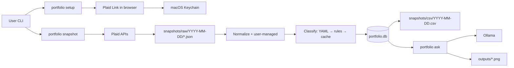

# Portfolio Review

A local CLI for macOS that links investment and bank accounts through Plaid, runs portfolio snapshots into SQLite, classifies holdings into asset buckets, and answers natural-language questions with a local Ollama agent.

## Purpose

Households often spread assets across many brokerage, retirement, and bank accounts. This tool answers recurring questions in one place:

- What is total net worth, and how is it split across asset types (cash, bonds, equity, gold, commodities, crypto, real estate)?
- How much sits in **taxable** vs **tax-advantaged** accounts?
- How has allocation changed since the last snapshot?

Each snapshot is stored locally so you can compare over time. Raw Plaid responses are archived for debugging; normalized holdings and rollups live in SQLite and CSV exports.

## What it does

| Capability | Description |
|------------|-------------|
| **Plaid linking** | Connect institutions in the browser; access tokens stay in the macOS Keychain |
| **Account preferences** | Include or exclude accounts, set owner tags, override tax treatment |
| **User-managed assets** | Track real estate, private equity, and other assets Plaid does not see |
| **Snapshots** | Fetch holdings, classify, rebuild summaries, export CSV, print a console report |
| **Ask agent** | Query snapshot data via Ollama with read-only SQL and chart tools |

**Out of scope for v1:** web UI, scheduled runs, tax lots, trade execution, multi-currency, per-owner dashboards.

## Architecture



### Tech stack

| Layer | Choice |
|-------|--------|
| Language | Python 3.12+ |
| CLI | Typer |
| Plaid Link UI | FastAPI + uvicorn (`localhost:8765`) |
| Database | SQLite (`portfolio.db`) |
| Secrets | `.env` for Plaid client credentials; Keychain for per-item access tokens |
| LLM | Ollama HTTP API |
| Charts | matplotlib |

### Project layout

```
portfolio/
  cli.py              # Typer entry point
  config.py           # Settings from .env
  plaid/              # Plaid client + Link server
  keychain/           # macOS Keychain token storage
  db/                 # Schema and queries
  snapshot/           # Fetch, normalize, export, console summary
  classify/           # YAML overrides, Plaid rules, classification cache
  managed/            # User-managed asset valuations
  agent/              # Ollama agent + tools (SQL, charts)
  charts/
classification.yaml   # Manual ticker → bucket overrides
snapshots/raw/        # Archived Plaid JSON per run (gitignored)
snapshots/csv/        # Exported snapshot CSVs
outputs/              # Chart PNGs from the agent (gitignored)
docs/superpowers/     # Design spec and implementation plan
```

### Documentation

- [Design spec](docs/superpowers/specs/2026-05-13-portfolio-review-design.md) — schema, classification rules, data model, non-goals
- [Implementation plan](docs/superpowers/plans/2026-05-13-portfolio-review.md) — build tasks and module map

## Prerequisites

- **macOS** (Keychain integration via `keyring`)
- **Python 3.12+**
- [Plaid](https://dashboard.plaid.com/) developer account with Investments product enabled
- **[Ollama](https://ollama.com/)** for `portfolio ask` only — see [Ollama setup](#ollama-setup-for-portfolio-ask) below (not required for snapshots or Plaid linking)

## Installation

From the repository root:

```bash
python3.12 -m venv .venv
source .venv/bin/activate
pip install -e ".[dev]"
```

Copy environment template and fill in Plaid credentials:

```bash
cp .env.example .env
```

Edit `.env`:

```bash
PLAID_CLIENT_ID=<from Plaid dashboard>
PLAID_SECRET=<sandbox or production secret>
PLAID_ENV=sandbox          # sandbox | production
OLLAMA_BASE_URL=http://localhost:11434
OLLAMA_MODEL=qwen3.5:4b
PORTFOLIO_DB_PATH=portfolio.db
```

Use `PLAID_ENV=sandbox` until Production access is approved. Never commit `.env` or access tokens.

`OLLAMA_MODEL` must match a model you have pulled in Ollama (see [Ollama setup](#ollama-setup-for-portfolio-ask)). Good tool-calling options include `qwen3.5:4b`, `qwen2.5`, and `llama3.1`.

Activate the virtual environment in every new shell before running commands:

```bash
source .venv/bin/activate
```

## Ollama setup (for `portfolio ask`)

`portfolio ask` talks to a local [Ollama](https://ollama.com/) server over HTTP. Snapshots, Plaid linking, and managed assets do **not** need Ollama. If you only use those commands, skip this section.

Assume a fresh checkout with Ollama not installed yet.

### 1. Install Ollama

**Homebrew (recommended on macOS):**

```bash
brew install ollama
```

**Or** download the macOS app from [ollama.com/download](https://ollama.com/download) and install it like any other application.

Verify the CLI is available:

```bash
ollama --version
```

### 2. Run Ollama in the background

Pick one approach and stick with it. You do **not** need a dedicated terminal tab left open forever.

**Option A — Homebrew service (recommended):**

```bash
brew services start ollama
```

Ollama starts in the background and survives closing the terminal. It can also restart automatically after reboot depending on your Homebrew setup.

**Option B — Ollama desktop app:**

Open **Ollama** from Applications. It runs from the menu bar and keeps the server up without a terminal.

**Option C — Foreground in a terminal (manual):**

```bash
ollama serve
```

This works for quick tests, but **closing that terminal tab or pressing Ctrl+C stops Ollama**, and `portfolio ask` will fail with a connection error until you start it again.

### 3. Configure the model in `.env`

Set `OLLAMA_MODEL` in `.env` to the model tag you want the agent to use:

```bash
OLLAMA_BASE_URL=http://localhost:11434
OLLAMA_MODEL=qwen3.5:4b
```

Other models that work well for tool calling include `qwen2.5` and `llama3.1`. The value must match the tag shown by `ollama list` exactly.

### 4. Pull the model

Download the model once (first pull can take several minutes and several GB of disk):

```bash
ollama pull qwen3.5:4b
```

Use the same name as `OLLAMA_MODEL` in `.env`. To switch models later, update `.env` and run `ollama pull <new-model>`.

List installed models:

```bash
ollama list
```

### 5. Check that Ollama is running

**API reachable** (should return JSON, not “connection refused”):

```bash
curl -s http://localhost:11434/api/tags
```

**Models installed:**

```bash
ollama list
```

**Homebrew service status** (if you use `brew services`):

```bash
brew services list | grep ollama
```

`started` means the background service is running. `none` means it is not registered as a service (you may still have Ollama running via the app or a manual `ollama serve`).

**Process check:**

```bash
pgrep -l ollama
```

### 6. Stop or restart Ollama

| How you started it | Stop | Restart |
|--------------------|------|---------|
| `brew services start ollama` | `brew services stop ollama` | `brew services restart ollama` |
| Ollama desktop app | Quit Ollama from the menu bar | Open the app again |
| `ollama serve` in a terminal | Ctrl+C in that terminal | Run `ollama serve` again |

Stopping Ollama only affects local LLM use. It does not touch `portfolio.db`, snapshots, or Plaid tokens.

If other tools on your Mac also use Ollama, avoid stopping the shared daemon unless you intend to shut down all local LLM workloads.

### 7. Try `portfolio ask`

With the venv active, Ollama running, the model pulled, and at least one snapshot in the database:

```bash
portfolio ask "Plot a pie chart of asset buckets for the latest snapshot"
```

Chart PNGs are written under `outputs/`. If Ollama is down or the model is missing, the CLI prints a short error with the fix (`ollama serve` / `brew services start ollama`, `ollama pull <model>`).

## User flow

### 1. Link accounts

```bash
portfolio setup
```

This starts a local server at `http://localhost:8765`, opens Plaid Link in your browser, and lets you pick which accounts to include. On success:

- The Plaid `access_token` is stored in Keychain under service `portfolio-review`, keyed by `item_id`
- Institution and account metadata are written to `portfolio.db`

Re-run `portfolio setup` to link additional institutions. If an item needs re-authentication (`login_required` in snapshot output), run setup again for that institution.

### 2. Review and configure accounts

List linked accounts and current preferences:

```bash
portfolio accounts-list
```

Exclude an account, set an owner label, or override tax treatment:

```bash
portfolio accounts-configure --account-id <id> --no-included
portfolio accounts-configure --account-id <id> --owner-tag spouse
portfolio accounts-configure --account-id <id> --tax-treatment tax-advantaged
```

Tax treatment is either `taxable` or `tax-advantaged` (401k, IRA, Roth, HSA, 529, etc.). Subtype-based defaults apply unless you override.

### 3. Add assets Plaid does not track (optional)

```bash
portfolio managed add \
  --asset-name "Primary home" \
  --asset-kind real_estate \
  --value 850000 \
  --owner-tag household \
  --tax-treatment taxable

portfolio managed update "Primary home" --value 875000 --effective-date 2026-05-01

portfolio managed list
```

`asset_kind` is one of `real_estate`, `private_equity`, or `other`. Snapshots carry forward the latest valuation on or before the snapshot date.

### 4. Run a snapshot

```bash
portfolio snapshot
```

Optional backdated or historical date:

```bash
portfolio snapshot --snapshot-date 2026-05-13
```

The pipeline:

1. Fetches Plaid balances and holdings for all linked items (included accounts only)
2. Archives raw JSON under `snapshots/raw/<date>/`
3. Replaces any existing rows for that date in `holdings_snapshot` and `snapshot_summary`
4. Classifies holdings (YAML overrides → Plaid metadata rules → cached `classifications` table)
5. Rebuilds rollups and writes `snapshots/csv/<date>.csv`
6. Prints net worth, bucket allocation, drift vs the previous snapshot, re-auth warnings, and unclassified holdings

Re-running on the **same date** replaces that day's data; it does not append duplicates.

### 5. Ask questions

Requires [Ollama setup](#ollama-setup-for-portfolio-ask) and at least one snapshot in the database:

```bash
portfolio ask "What is my equity allocation in tax-advantaged accounts?"
portfolio ask "Plot a pie chart of asset buckets for the latest snapshot"
```

The agent uses read-only SQL against `portfolio.db` and can write chart PNGs to `outputs/`.

### 6. Tune classification (as needed)

Edit `classification.yaml` for tickers or names that rules do not resolve:

```yaml
VTI: Equity
BND: Bond
GLD: Gold
```

Buckets: `Cash`, `Bond`, `Equity`, `Gold`, `Commodity`, `Crypto`, `RealEstate`. After editing YAML, run `portfolio snapshot` again (or delete rows from `classifications` for specific assets — see below).

## CLI reference

| Command | Description |
|---------|-------------|
| `portfolio setup` | Start Plaid Link server and link accounts |
| `portfolio accounts-list` | List accounts and preferences |
| `portfolio accounts-configure` | Update inclusion, owner tag, or tax treatment |
| `portfolio managed add` | Register a user-managed asset |
| `portfolio managed update <name>` | Append a new valuation |
| `portfolio managed list` | Show latest valuations |
| `portfolio snapshot` | Full snapshot pipeline |
| `portfolio ask "<question>"` | Ollama-backed portfolio Q&A |

## Data model (quick reference)

| Table | Role |
|-------|------|
| `items` | Plaid institutions / link health |
| `accounts` | Plaid and synthetic user-managed accounts |
| `user_managed_holdings` | Valuation history for manual assets |
| `holdings_snapshot` | Point-in-time holdings (Plaid + user-managed) |
| `classifications` | Cached asset_name → bucket |
| `snapshot_summary` | Materialized rollups by bucket, tax treatment, owner |

Net worth for a date: `SUM(total_value) FROM snapshot_summary WHERE snapshot_date = ?`.

## Debugging

### Inspect the database

```bash
sqlite3 portfolio.db
```

Useful commands inside the SQLite shell:

```sql
.tables
.schema holdings_snapshot

-- Latest snapshot net worth
SELECT snapshot_date, SUM(total_value) AS net_worth
FROM snapshot_summary
GROUP BY snapshot_date
ORDER BY snapshot_date DESC;

-- Holdings for a date
SELECT a.name, h.asset_name, h.bucket, h.value, a.tax_treatment
FROM holdings_snapshot h
JOIN accounts a ON a.account_id = h.account_id
WHERE h.snapshot_date = '2026-05-13'
ORDER BY h.value DESC;

-- Unclassified assets
SELECT asset_name, value FROM holdings_snapshot
WHERE snapshot_date = '2026-05-13' AND bucket IS NULL;

-- Classification cache
SELECT * FROM classifications ORDER BY classified_at DESC;

-- Linked items and status
SELECT * FROM items;
```

Default DB path is `portfolio.db` in the repo root (override with `PORTFOLIO_DB_PATH` in `.env`).

### Raw Plaid payloads

After each snapshot, check `snapshots/raw/<date>/<item_id>-holdings.json` and `*-balances.json` when normalized values look wrong.

### CSV exports

Human-readable exports: `snapshots/csv/<date>.csv` (detail + summary sections).

### Classification issues

If holdings show up as unclassified after a snapshot:

1. Add an entry to `classification.yaml`
2. Or insert/update `classifications` directly in SQLite
3. Re-run `portfolio snapshot` for that date

### Plaid / Keychain issues

List generic passwords for this app in Keychain Access: search for **portfolio-review**.

From the terminal (replace `<item_id>` with the id from `items` or snapshot warnings):

```bash
# View (will prompt for keychain password)
security find-generic-password -s portfolio-review -a <item_id>

# Delete one token
security delete-generic-password -s portfolio-review -a <item_id>
```

Or from Python with the venv active:

```bash
python -c "from portfolio.keychain.tokens import delete_access_token; delete_access_token('<item_id>')"
```

If a token is missing or invalid, delete it and run `portfolio setup` to link again.

### Agent / Ollama

See [Ollama setup](#ollama-setup-for-portfolio-ask) for install, background service, model pull, and stop/restart.

Quick checks:

```bash
curl -s http://localhost:11434/api/tags   # server up?
ollama list                                # model from OLLAMA_MODEL installed?
```

Chart output lands in `outputs/`.

### Run tests

```bash
source .venv/bin/activate
pytest
```

## Reset and clean slate

| Goal | Action |
|------|--------|
| **Drop all local portfolio data** | `rm portfolio.db` (schema is recreated on next command) |
| **Remove Plaid tokens** | Delete Keychain entries for service `portfolio-review` (see above) |
| **Clear a single snapshot date** | Re-run `portfolio snapshot --snapshot-date <date>` to replace, or `DELETE FROM holdings_snapshot WHERE snapshot_date = ?` and matching `snapshot_summary` rows |
| **Clear classification cache** | `DELETE FROM classifications` then re-snapshot |
| **Remove raw archives** | `rm -rf snapshots/raw/<date>/` |
| **Full unlink + restart** | Delete `portfolio.db`, delete all Keychain tokens for `portfolio-review`, run `portfolio setup` |

`portfolio.db`, `snapshots/raw/`, `outputs/`, and `.env` are gitignored; CSV files under `snapshots/csv/` are kept in the repo unless you remove them locally.

## Security notes

- Plaid **client id/secret** belong in `.env` only
- Plaid **access tokens** belong in Keychain only — never in the database or git
- The Link server binds to `127.0.0.1:8765` and is meant for local setup only
- Rotate Plaid secrets if they are ever exposed

## References

- [Plaid Investments API](https://plaid.com/docs/api/products/investments/)
- [Plaid Link quickstart](https://github.com/plaid/quickstart)
