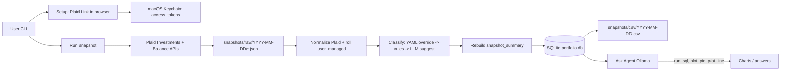

# Portfolio Review Tool — Design Spec

**Date:** 2026-05-13  
**Status:** Approved  
**Origin:** [product-idea.md](../../../product-idea.md), brainstorming sessions in `.cursor/plans/portfolio_review_spec_c02dcd66.plan.md`

## Purpose

A local CLI application for macOS that:

1. Links investment and bank accounts via **Plaid**
2. Tracks **user-managed** assets (real estate, private equity) with occasional manual valuations
3. Runs ad-hoc **portfolio snapshots** — normalized holdings in SQLite, classified into asset buckets
4. Answers natural-language questions via a **local Ollama** agent with read-only SQL and chart tools

Household view is **combined** in v1; each account has an **owner tag** for future filtering.

## Non-goals (v1)

- CSV/file bulk import
- Tax-lot / cost basis / capital gains
- Trade execution
- Performance attribution (TWR/MWR)
- Multi-currency
- Per-owner dashboards
- Scheduled snapshots (`launchd`)
- Web UI

## Architecture




## Tech stack


| Layer    | Choice                                                                     |
| -------- | -------------------------------------------------------------------------- |
| Language | Python 3.12                                                                |
| CLI      | Typer                                                                      |
| Plaid    | `plaid-python` SDK                                                         |
| Link UI  | FastAPI + uvicorn (localhost:8765)                                         |
| DB       | SQLite (`portfolio.db`)                                                    |
| Secrets  | `.env` (gitignored) for Plaid client id/secret; Keychain for access tokens |
| LLM      | Ollama HTTP API                                                            |
| Charts   | matplotlib                                                                 |
| Config   | `classification.yaml` + SQLite `classifications` cache                     |


## User journeys

### Setup — `portfolio setup`

1. Start local server; open browser to Plaid Link.
2. On success: exchange `public_token` → `access_token`; store token in **Keychain** keyed by `item_id`.
3. Persist `items`, `accounts` in SQLite.
4. User configures per account: **included**, **owner_tag**, **tax_treatment** (auto-derived from subtype, overridable). Only two values: **`taxable`** and **`tax-advantaged`** (401k, IRA, Roth, HSA, 529, etc.).

Re-run for new institutions or Plaid **update mode** when `ITEM_LOGIN_REQUIRED`.

### User-managed assets


| Command                               | Behavior                                                                                        |
| ------------------------------------- | ----------------------------------------------------------------------------------------------- |
| `portfolio managed add`               | Register asset + synthetic manual `accounts` row + initial valuation in `user_managed_holdings` |
| `portfolio managed update <name>`     | Append valuation row (`value`, `effective_date`)                                                |
| `portfolio managed list`              | Latest value per active asset                                                                   |
| `portfolio managed ask` (optional v1) | Ollama drafts update; user confirms                                                             |


**Defaults:** `real_estate` → RealEstate bucket; `private_equity` → Equity bucket.

### Snapshot — `portfolio snapshot`

1. Fetch Plaid balances + holdings; archive raw JSON under `snapshots/raw/YYYY-MM-DD/`.
2. Use today's date as `snapshot_date` in `holdings_snapshot`. If the same `snapshot_date` already exists, delete all `holdings_snapshot` and `snapshot_summary` rows for this `snapshot_date`.
3. Insert Plaid rows + materialized user-managed rows (carry-forward valuations) into `holdings_snapshot`.
4. Classify; denormalize `bucket` on each holding row; update `classifications`.
5. Rebuild `snapshot_summary`.
6. Export CSV from SQLite.
7. Print console summary (totals, drift, re-auth warnings, unclassified holdings).

### Ask Agent — `portfolio ask "<question>"`

Ollama with tools:

- `run_sql` — read-only; prefer `snapshot_summary` for rollups, `holdings_snapshot` for detail
- `plot_pie`, `plot_line` — PNG to `outputs/`
- `summarize` — text from row sets

## Database schema

### Design principles

- **`holdings_snapshot`** is the unified point-in-time fact table (Plaid + user-managed).
- No **`securities`** table — identity is **`asset_name`** plus optional Plaid columns on the same row.
- **`user_managed_holdings`** holds valuation **history**; snapshots **materialize** as-of values.
- **`snapshot_summary`** is a **materialized table** rebuilt each run (not a VIEW).
- Same-date re-run: **delete-then-insert** (never append duplicates).

### Tables

#### `items`

| Column | Description |
|--------|-------------|
| `item_id` | Plaid Item id (PK) |
| `institution_name` | Institution display name |
| `status` | Link health (e.g. ok, login_required) |
| `last_synced_at` | Last successful Plaid fetch |

#### `accounts`

| Column | Description |
|--------|-------------|
| `account_id` | Account id (PK) |
| `item_id` | FK to `items`; NULL for manual accounts |
| `source` | `plaid` or `user_managed` |
| `name` | Account display name |
| `type` | Plaid account type (`investment`, `depository`, `credit`, `loan`, `other`); NULL for user-managed synthetic accounts |
| `subtype` | Plaid account subtype |
| `owner_tag` | Household owner label |
| `included` | 1 = included in snapshots |
| `tax_treatment` | `taxable` or `tax-advantaged` (auto-derived from subtype; see below) |
| `tax_treatment_override` | User override; must be `taxable` or `tax-advantaged` |

**`tax_treatment` values (v1):** only `taxable` and `tax-advantaged`. Anything that is not a taxable account (pre-tax 401k, Roth IRA, traditional IRA, HSA, 529, etc.) maps to **`tax-advantaged`**.

#### `user_managed_holdings`

Valuation history for manually tracked assets.

| Column | Description |
|--------|-------------|
| `id` | Row id (PK) |
| `asset_name` | Stable user-chosen name |
| `asset_kind` | `real_estate`, `private_equity`, or `other` |
| `account_id` | FK to synthetic manual `accounts` row |
| `value` | Valuation amount |
| `effective_date` | Date this value applies from (inclusive) |
| `source` | `manual` or `llm` |
| `notes` | Optional notes |
| `created_at` | Insert timestamp |
| `is_active` | 0 = retired asset |

#### `holdings_snapshot`

Canonical holdings per snapshot date (Plaid + materialized user-managed).

| Column | Description |
|--------|-------------|
| `id` | Row id (PK) |
| `snapshot_date` | Snapshot date (ISO) |
| `account_id` | FK to `accounts` |
| `source` | `plaid` or `user_managed` |
| `asset_name` | Ticker, `plaid_security_id`, `cash`, or user-managed name |
| `display_name` | Optional longer Plaid security name |
| `plaid_security_id` | Plaid security id (nullable) |
| `plaid_type` | Plaid security type (nullable) |
| `plaid_subtype` | Plaid security subtype (nullable) |
| `is_cash_equivalent` | Plaid flag (nullable) |
| `quantity` | Shares/units; ingest only, not in CSV export |
| `unit_price` | Price per unit (nullable) |
| `price_as_of` | Quote as-of date (nullable) |
| `value` | Holding value |
| `bucket` | Classification bucket (nullable until classified) |

**Unique:** `(snapshot_date, account_id, asset_name, source)`

#### `classifications`

| Column | Description |
|--------|-------------|
| `asset_name` | PK |
| `bucket` | Cash, Bond, Equity, Gold, Commodity, Crypto, RealEstate |
| `source` | yaml, rule, asset_kind_default, llm_confirmed |
| `classified_at` | When classified |

#### `snapshot_summary`

Materialized rollups rebuilt each snapshot run.

| Column | Description |
|--------|-------------|
| `id` | Row id (PK) |
| `snapshot_date` | Snapshot date |
| `bucket` | Asset bucket |
| `tax_treatment` | From `accounts` |
| `owner_tag` | From `accounts` |
| `total_value` | `SUM(value)` for this group |

**Unique:** `(snapshot_date, bucket, tax_treatment, owner_tag)`

No sentinel rows; net worth = `SUM(total_value) WHERE snapshot_date = ?`.

### `asset_name` rules


| Source            | `asset_name`                                         |
| ----------------- | ---------------------------------------------------- |
| Plaid marketable  | `ticker_symbol` if present, else `plaid_security_id` |
| Bank / depository | `"cash"`                                             |
| User-managed      | User-chosen name                                     |


### Carry-forward (user-managed)

On snapshot date `D`, use valuation with max `effective_date` where `effective_date <= D`.

### Tax treatment mapping

| Account type (examples) | `tax_treatment` |
|-------------------------|-----------------|
| Brokerage, checking, savings, taxable investment | `taxable` |
| 401k, 403b, IRA, Roth IRA, SEP/SIMPLE IRA, pension, HSA, 529, other retirement/education | `tax-advantaged` |

User override via `tax_treatment_override` on setup or `accounts-configure`. Manual / user-managed accounts set `tax_treatment` at add time (default `taxable` for real estate unless user specifies otherwise).

### Classification buckets

Cash, Bond, Equity, Gold, Commodity, Crypto, **RealEstate**.


| Input                       | Default bucket                       |
| --------------------------- | ------------------------------------ |
| `asset_name=cash`           | Cash                                 |
| Plaid `fixed income`        | Bond                                 |
| Plaid `equity`              | Equity                               |
| Plaid `cryptocurrency`      | Crypto                               |
| `asset_kind=real_estate`    | RealEstate                           |
| `asset_kind=private_equity` | Equity                               |
| ETF / mutual fund / other   | YAML override, else Ollama + confirm |


YAML is human-editable; SQLite `classifications` is the query cache.

### Interactive LLM classification during `portfolio snapshot` (v1)

When rule-based classification and YAML overrides both fail to assign a bucket for an `asset_name`, the snapshot pipeline **must** obtain a suggestion from the local **Ollama** HTTP API (`OLLAMA_BASE_URL`, `OLLAMA_MODEL` from env), present it in the **terminal**, and persist a row in `classifications` **only after explicit user confirmation**. The stored `source` for any bucket chosen through this path is **`llm_confirmed`** (including when the user overrides the model suggestion via manual bucket pick in the same prompt).

**Scope:** v1 assumes a **normal interactive terminal**. There is **no** non-interactive or CI escape hatch; piped/automated runs may block on stdin when unknown assets exist.

**When it runs:** After holdings for the snapshot date are written to `holdings_snapshot`, the classifier iterates over distinct `asset_name` values for that date (see ordering below). If `classifications` already has a row for that `asset_name`, it is left unchanged. Otherwise YAML + rules run as today; if the result is still unclassified, the Ollama + confirm flow runs for that asset.

**Deterministic ordering:** Pending assets are processed in ascending lexicographic order of `asset_name` so runs are reproducible.

**Holding context sent to the model:** JSON-safe subset including at least: `asset_name`, `display_name` (a representative value from `holdings_snapshot` for that name and date, e.g. `MAX(display_name)` in SQL), `plaid_type`, `plaid_subtype`, `source`, and for `user_managed` rows the resolved `asset_kind` from active `user_managed_holdings` (same logic as today’s classifier).

**Model output:** A single JSON object, e.g. `{"bucket":"Equity","reason":"<short string>"}`. The `bucket` value must be one of: Cash, Bond, Equity, Gold, Commodity, Crypto, RealEstate. Malformed JSON, unknown bucket strings, or HTTP/connect failures are shown to the user as errors; the user may still **manually** pick a bucket or **skip** the asset.

**Terminal UX (single asset):** Print a short summary card (identifiers + Plaid labels + suggested bucket and reason, or an error if Ollama failed). Then prompt for one line of input:

| Key / action | Behavior |
|--------------|----------|
| `y` | Accept the suggested bucket (if a valid suggestion exists; otherwise re-prompt or treat as invalid) |
| `n` | Skip: do not insert/update `classifications` for this asset; leave bucket null on holdings for this name until a later run or YAML edit |
| `m` | Manual: user chooses one of the seven allowed buckets from a numbered menu |
| `q` | Quit the interactive classification phase: stop prompting for further pending assets; **already confirmed** assets in this run remain persisted; remaining unknowns stay unclassified for this snapshot |

After the loop, the existing bulk `UPDATE holdings_snapshot … JOIN classifications` behavior applies so confirmed rows get `bucket` populated for the snapshot date.

**Testability:** The stdin/print path is implemented with **injectable** `read_line` / `write` callables (defaulting to `input` / `print`) so automated tests do not require a TTY.

**Out of scope (v1):** Separate `portfolio … review` command, prefetch/suggestion staging tables, writing accepted buckets to `classification.yaml`, and non-interactive snapshot flags.

## CSV export (derived)

**Detail:** `snapshot_date`, account name, `asset_name`, `bucket`, `value`, `tax_treatment`, `owner_tag`, `source` — **no quantity**.

**Summary:** rows from `snapshot_summary` for that date.

## Plaid configuration

```bash
# .env (gitignored)
PLAID_CLIENT_ID=<from dashboard>
PLAID_SECRET=<sandbox or production secret>
PLAID_ENV=sandbox   # sandbox | production
```

- Sandbox until Production access approved.
- Never commit secrets. Rotate if exposed.
- Access tokens per Item: **Keychain only**.

## Open items

- **Ollama model** — smoke-test tool calling (e.g. `llama3.1`, `qwen2.5`) and interactive classification during `portfolio snapshot` (see above); implementation plan: [`2026-05-14-interactive-llm-classification.md`](../plans/2026-05-14-interactive-llm-classification.md).

## References

- [Plaid Investments API](https://plaid.com/docs/api/products/investments/)
- [Plaid Link quickstart](https://github.com/plaid/quickstart)

