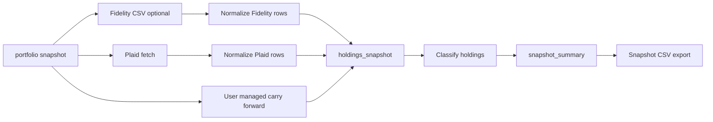

# Fidelity CSV Import

**Date:** 2026-05-16  
**Status:** Draft  
**Origin:** Fidelity does not support Plaid for these accounts, so snapshots need to ingest the downloaded Fidelity positions CSV.

## Purpose

Add Fidelity CSV support as a first-class local data source. The app should discover Fidelity accounts from a downloaded positions CSV, let the user choose which accounts to include, and import holdings from those included accounts during a snapshot run.

This keeps the portfolio model unified: Plaid, Fidelity CSV, and user-managed assets all end up in `holdings_snapshot`, then flow through the existing classification, summary, export, and ask-agent paths.

## Decision

Use a first-class `fidelity` account and holding source alongside `plaid` and `user_managed`.

The setup flow is explicit and interactive:

```bash
portfolio fidelity setup --csv snapshots/Portfolio_Positions_May-15-2026.csv
```

The snapshot flow accepts an optional Fidelity CSV:

```bash
portfolio snapshot --fidelity-csv snapshots/Portfolio_Positions_May-15-2026.csv
```

Fidelity account IDs are the CSV `Account Number` values. This keeps account identity understandable and matches the source file.

## Input CSV

The observed Fidelity positions CSV has these relevant columns:

- `Account Number`
- `Account Name`
- `Symbol`
- `Description`
- `Quantity`
- `Last Price`
- `Current Value`
- `Type`

Rows are grouped by account. Some rows contain blank values or Fidelity placeholders such as `--`. The file can end with blank lines and Fidelity disclaimer text after the data rows; those trailer rows should be ignored.

The Fidelity `Type` column indicates whether a holding is marginable. It is not an asset-class or cash indicator and should be ignored by all setup, normalization, classification, and summary logic.

## Account Setup

Add a `fidelity` Typer subcommand group with a `setup` command.

Setup should:

1. Validate required CSV headers.
2. Read data rows until the first blank row or trailer/disclaimer row.
3. Group accounts by `Account Number` and `Account Name`.
4. Upsert one `accounts` row per discovered Fidelity account.
5. Prompt account preferences.

For each discovered account, prompt:

1. Whether to include it in snapshots.
2. If included, whether the tax treatment is `taxable` or `tax-advantaged`.

Do not prompt for owner tag in the Fidelity setup flow. Store `owner_tag='household'` by default. The existing account configuration command can still change owner tags later.

Do not infer or store Fidelity subtypes in v1. Store `type='investment'` and `subtype=NULL`.

For excluded accounts, do not ask for tax treatment. Store `tax_treatment=NULL` and `tax_treatment_override=NULL`.

When setup is re-run with a newer CSV, existing saved values should become prompt defaults. This lets the user confirm or adjust accounts without re-entering every choice from scratch.

## Schema Changes

Extend `accounts.source` to allow:

- `plaid`
- `fidelity`
- `user_managed`

Allow `accounts.tax_treatment` to be null. The current schema requires a value, but excluded Fidelity accounts should not need one.

Snapshot summaries still require non-null tax treatment. That is acceptable because only included accounts with imported holdings should reach `snapshot_summary`. Fidelity snapshot import must validate that every included Fidelity account represented in the CSV has a non-null tax treatment before inserting holdings.

Extend `holdings_snapshot.source` to allow:

- `plaid`
- `fidelity`
- `user_managed`

No new table is required for Fidelity accounts or Fidelity holdings.

No migration path is required for the current local database. Existing local `accounts` and `holdings_snapshot` tables can be deleted and recreated from the updated schema before using Fidelity CSV import.

## Snapshot Flow

`portfolio snapshot` remains valid without a Fidelity file. When `--fidelity-csv <path>` is provided, the runner should:

1. Fetch and normalize Plaid holdings as it does today.
2. Parse the Fidelity CSV.
3. Validate that every included Fidelity account in the CSV exists in `accounts` and has tax treatment.
4. Normalize holdings for included Fidelity accounts.
5. Materialize user-managed rows.
6. Insert all rows into `holdings_snapshot`.
7. Run classification.
8. Rebuild `snapshot_summary`.
9. Export the snapshot CSV.



## Holding Normalization

Add a focused parser/normalizer module, likely `portfolio/snapshot/fidelity_csv.py`. Keep Fidelity CSV parsing separate from `portfolio/snapshot/normalize.py`, which is Plaid-specific.

Map Fidelity rows to `holdings_snapshot`:

- `snapshot_date`: selected snapshot date
- `account_id`: `Account Number`
- `source`: `fidelity`
- `asset_name`: `Symbol`
- `display_name`: `Description`
- `quantity`: parsed `Quantity`, or null for blank and `--`
- `unit_price`: parsed `Last Price`, or null for blank and `--`
- `price_as_of`: snapshot date
- `value`: parsed `Current Value`
- `plaid_security_id`: null
- `plaid_type`: null
- `plaid_subtype`: null
- `is_cash_equivalent`: 1 for cash-like rows, otherwise 0
- `bucket`: null until classification runs

Skip rows with an empty `Symbol`. In the observed CSV, the 401(k) row with description `BROKERAGELINK` and an empty symbol is a reference to the separate BrokerageLink account, not a distinct holding to count in the snapshot.

Parse money values such as `$19,324.50`, signed dollar values, percent values when needed, and placeholders such as `--`. `Current Value` is required for data rows; unparseable values should produce a clear row-level error.

Duplicate symbols within the same account should aggregate into one row keyed by `(snapshot_date, account_id, asset_name, source)`.

## Cash Detection

Mark Fidelity rows as cash-equivalent when they are clearly cash-like:

- Symbols ending in `**` for money market positions such as `SPAXX**` and `FDRXX**`
- Descriptions containing `HELD IN MONEY MARKET`
- Bank deposit portfolio rows

Do not use the Fidelity `Type` column for cash detection. In the observed CSV, normal ETFs can appear with `Type=Cash`; those should remain ordinary securities.

## Classification

Fidelity holdings should use the existing classification pipeline:

1. `classification.yaml` overrides
2. metadata/rule-based classification
3. cached `classifications`
4. local Ollama suggestion and user confirmation for unknown assets

Some Fidelity rows use CUSIP-like symbols or plan-specific identifiers. Keep the raw `Symbol` as `asset_name` so the user can classify it once and persist the result.

## Validation And Errors

Setup should fail clearly if the CSV lacks required headers:

- `Account Number`
- `Account Name`
- `Symbol`
- `Description`
- `Quantity`
- `Last Price`
- `Current Value`

Snapshot import should fail if `--fidelity-csv` contains included accounts that were not set up. The message should list missing account numbers and tell the user to run:

```bash
portfolio fidelity setup --csv <file>
```

Snapshot import should also fail if an included Fidelity account has `tax_treatment=NULL`. This catches incomplete setup before partial holdings are inserted.

Trailer and disclaimer rows should be ignored. Data rows with missing or unparseable `Current Value` should fail with account number, symbol, and row number.

## Non-goals

- Do not add Fidelity authentication.
- Do not add automatic CSV file discovery.
- Do not add tax-lot, cost-basis, or realized-gain tracking.
- Do not build a generic import framework for arbitrary broker CSVs.
- Do not rename existing `plaid_*` columns in this change.
- Do not prompt for owner tags in Fidelity setup.

## Testing

Add tests for:

- Discovering accounts from the observed Fidelity CSV shape.
- Interactive setup prompts: included account asks for tax treatment; excluded account does not.
- Re-running setup preserves saved values as defaults.
- Parsing currency, quantity, blank values, and `--` placeholders.
- Ignoring blank and Fidelity disclaimer trailer rows.
- Ignoring rows with empty `Symbol`, including the observed `BROKERAGELINK` reference row.
- Normalizing included Fidelity holdings into `holdings_snapshot`-style rows.
- Aggregating duplicate same-account same-symbol rows even when their ignored Fidelity `Type` values differ.
- Rejecting snapshot import when included CSV accounts are not set up.
- Rejecting snapshot import when included accounts have null tax treatment.
- Ignoring the Fidelity `Type` column for cash detection and classification.

Run focused tests first, then the full suite before treating implementation as complete.

## Risks

- Fidelity can change CSV headers or trailer formatting. Header validation and row-level parse errors should make breakage obvious.
- Account numbers are stable enough for local identity but are sensitive data. The CSV should remain in ignored snapshot/input paths and should not be committed.
- Relaxing `accounts.tax_treatment` to nullable affects existing queries. Summary-building and snapshot import must continue to require tax treatment for included accounts with holdings.
- Existing local databases need manual table recreation for this change; automated migration is out of scope.

## Self-review (2026-05-16)

- **Placeholders:** None.
- **Consistency:** Setup writes Fidelity accounts, snapshot imports only included Fidelity accounts, summary rows still require tax treatment, and Fidelity `Type` is ignored consistently.
- **Scope:** Focused on Fidelity account setup and optional snapshot CSV ingestion; automated database migration is out of scope.
- **Ambiguity:** Excluded accounts keep null tax treatment; included accounts must have explicit user-selected tax treatment before import; rows with empty `Symbol` are skipped rather than imported with a fallback name.
