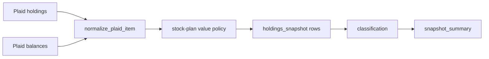

# Stock Plan Valuation Normalization

**Date:** 2026-05-16  
**Status:** Draft  
**Origin:** Investigation of incorrect Plaid stock-plan values in the 2026-05-15 raw snapshot.

## Purpose

Correct how `portfolio snapshot` normalizes Plaid stock-plan accounts so vested employer stock is counted correctly, unvested awards are excluded from current portfolio value, and unusable zero-value stock-plan holdings can fall back to Plaid's account balance when the balance is the only reliable value.

## Problem

Two Plaid investment accounts with `subtype: "stock plan"` produce incorrect `holdings_snapshot` values. The examples below use anonymized account IDs and rounded fixture values:

- Account `stock-plan-zero-value-example`, named `Stock Plan (Example A)`, has `balances.current: 7500.00`, but its example equity holding has `quantity: 0.0`, `institution_value: 0.0`, and no `vested_value`. The current normalizer records the holding as `0.0`.
- Account `stock-plan-vested-lots-example`, named `Example Stock Plan`, has `balances.current: 5100.00`. Its holdings include cash value `100.00` and multiple example equity lots. Four equity lots have `vested_value: 0.0`; one has `vested_value: 5000.00`. The current duplicate aggregation sums all equity `institution_value` fields into `15000.00`, which includes unvested awards.

The root cause is in `portfolio/snapshot/normalize.py`: raw holdings are converted with `value = institution_value`, then duplicate rows are merged by `(snapshot_date, account_id, asset_name, source)`. That is acceptable for normal brokerage duplicate holdings, but stock-plan holdings need compensation-specific interpretation.

## Decision

For accounts whose Plaid subtype is `stock plan`, the normalizer should use this policy:

1. For non-cash holdings, prefer `vested_value` when Plaid provides it.
2. For non-cash quantity, prefer `vested_quantity` when Plaid provides it.
3. For cash-equivalent holdings, keep the cash value from the holding value fields. Cash is already vested account value.
4. After stock-plan holdings are aggregated, apply a narrow balance fallback only when the account has exactly one non-cash holding row, the row has zero normalized value, the row did not have usable vested data, and `balances.current` is positive.
5. The fallback value is `balances.current - normalized_cash_value` for that account, never less than zero.
6. Non-stock-plan investment accounts keep the current `institution_value` behavior.

This preserves row-level asset names and avoids changing the database schema. For the vested-lots example, the normalized output should be one equity row worth `5000.00` and one cash-equivalent row worth `100.00`, so the account total matches `5100.00`. For the zero-value example, the normalized equity row should be worth `7500.00`; quantity remains whatever Plaid provided because the raw data does not contain a reliable share count.

## Architecture

The change belongs in the Plaid normalization layer:

Implementation should stay local to `portfolio/snapshot/normalize.py`:

- Build `balance_account_by_id` from `balances_response["accounts"]`.
- Identify account subtype from the persisted account row first, then the balance account row.
- Add small helper functions for numeric conversion, cash detection, and stock-plan value selection.
- Keep existing duplicate aggregation semantics, but aggregate values that were already stock-plan adjusted.
- Reconcile the narrow stock-plan balance fallback after all holdings for the account have been normalized and merged.

No schema migration is required because the canonical table already stores only normalized point-in-time values.

## Non-goals

- Do not add tax-lot or award-vesting history.
- Do not add columns for raw `vested_value` or `vested_quantity`.
- Do not infer quantity for a zero-value stock-plan security from account balance and quote price.
- Do not allocate account balance across multiple non-cash stock-plan securities when Plaid provides unusable values.
- Do not change ordinary brokerage normalization.

## Testing

Add regression tests in `tests/test_normalize.py`:

- Stock-plan vested-lots fixture: cash plus vested and unvested equity lots should normalize to equity value `5000.00`, cash value `100.00`, and account total `5100.00`.
- Stock-plan zero-value fixture: zero-value non-cash holding plus account balance `7500.00` should normalize to equity value `7500.00`.
- Existing brokerage duplicate aggregation should continue to sum ordinary duplicate holdings.

Run `pytest tests/test_normalize.py -q` first, then `pytest -q` before treating the change as complete.

## Risks

- Plaid stock-plan payloads vary by institution. The fallback must stay narrow so it does not hide bad raw data or overwrite valid brokerage values.
- A future stock-plan account with multiple non-cash securities and unusable values cannot be safely reconciled from only `balances.current`; the normalizer should leave those rows unchanged rather than guessing.
- The vested-lots example's expected row-level value depends on whether cash is modeled separately. This spec keeps cash separate because it matches the existing holdings model and still reconciles to the account balance.

## Self-review (2026-05-16)

- **Placeholders:** None.
- **Consistency:** The policy explains both anonymized account shapes and keeps ordinary brokerage behavior unchanged.
- **Scope:** Single concern: Plaid stock-plan normalization in snapshots.
- **Ambiguity:** Cash remains a separate row; account-level reconciliation is expressed as total equity plus cash, not cash folded into the equity row.
